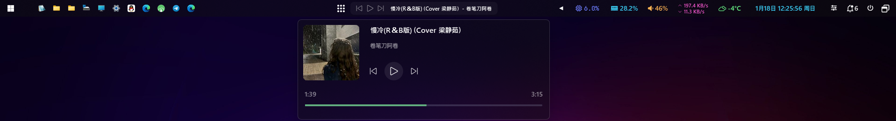
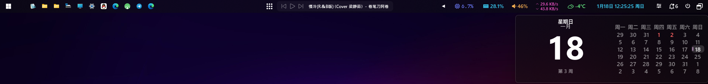
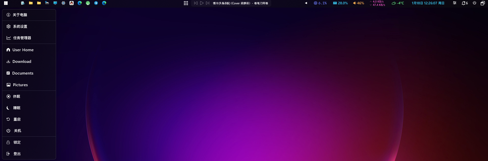



<h1 align="center">YASB Reborn 中文版</h1>

  YASB (Yet Another Status Bar) 是用 Python 编写的高度可配置 Windows 状态栏。
    
  
  
  
  
  
  

***

<h3 align="center">
  <a href="https://github.com/amnweb/yasb/wiki/Installation">安装</a>
  · <a href="https://github.com/amnweb/yasb/wiki">文档</a>
  · <a href="https://github.com/amnweb/yasb-themes">分享主题</a>
  · <a href="https://github.com/amnweb/yasb/discussions">讨论</a>
  · <a href="https://github.com/amnweb/yasb/issues">报告问题</a>
</h3>

***

# 修改说明
- 基于 [amnweb/yasb](https://github.com/amnweb/yasb) 二次开发。
- 完成界面与文档的中文化。
- 优化默认主题的视觉效果与可读性。

# 安装

### 需求
- 苹方字体、Nerd Fonts。推荐安装 [Nerd Fonts](https://www.nerdfonts.com/font-downloads)（建议使用 [JetBrainsMono](https://github.com/ryanoasis/nerd-fonts/releases/latest/download/JetBrainsMono.zip)）
- Windows 10 或 11

### 安装包
- 从 [GitHub Releases](https://github.com/amnweb/yasb/releases/latest) 下载最新安装包。
- 运行安装程序并按提示完成安装。
***

### 使用 Python
- 安装 Python 3.14
- 安装应用及依赖：
  - `pip install .`（常规安装）
  - `pip install -e .[dev]`（开发安装）
- 启动应用：
  - 在终端运行 `python src/main.py`（或点击 [yasb.vbs](src/yasb.vbs)）
  - 根据需要修改 [styles.css](src/styles.css) 和 [config.yaml](src/config.yaml)

# 演示

> [!NOTE]
> 仓库会持续更新，更新后请检查 [styles.css](src/styles.css) 和 [config.yaml](src/config.yaml) 是否有新功能或变更，否则可能导致配置不兼容。

# 当前可用组件列表

- **[Active Windows Title](https://github.com/amnweb/yasb/wiki/(Widget)-Active-Windows-Title)**：显示当前活动窗口标题。
- **[Applications](https://github.com/amnweb/yasb/wiki/(Widget)-Applications)**：显示预设应用列表。
- **[Ai Chat](https://github.com/amnweb/yasb/wiki/(Widget)-Ai-Chat)**：与 AI 模型交互的聊天组件。
- **[Battery](https://github.com/amnweb/yasb/wiki/(Widget)-Battery)**：显示电池状态。
- **[Bluetooth](https://github.com/amnweb/yasb/wiki/(Widget)-Bluetooth)**：显示蓝牙状态与已连接设备。
- **[Brightness](https://github.com/amnweb/yasb/wiki/(Widget)-Brightness)**：显示并调整亮度。
- **[Cava](https://github.com/amnweb/yasb/wiki/(Widget)-Cava)**：使用 Cava 显示音频可视化。
- **[Copilot](https://github.com/amnweb/yasb/wiki/(Widget)-Copilot)**：显示 GitHub Copilot 使用统计。
- **[CPU](https://github.com/amnweb/yasb/wiki/(Widget)-CPU)**：显示 CPU 使用率。
- **[Clock](https://github.com/amnweb/yasb/wiki/(Widget)-Clock)**：显示时间与日期。
- **[Custom](https://github.com/amnweb/yasb/wiki/(Widget)-Custom)**：自定义组件。
- **[Github](https://github.com/amnweb/yasb/wiki/(Widget)-Github)**：显示 GitHub 通知。
- **[GlazeWM Binding Mode](https://github.com/amnweb/yasb/wiki/(Widget)-GlazeWM-Binding-Mode)**：GlazeWM 绑定模式组件。
- **[GlazeWM Tiling Direction](https://github.com/amnweb/yasb/wiki/(Widget)-GlazeWM-Tiling-Direction)**：GlazeWM 平铺方向组件。
- **[GlazeWM Workspaces](https://github.com/amnweb/yasb/wiki/(Widget)-GlazeWM-Workspaces)**：GlazeWM 工作区组件。
- **[Glucose Monitor](https://github.com/amnweb/yasb/wiki/(Widget)-Glucose-Monitor)**：Nightscout 血糖监测组件。
- **[Grouper](https://github.com/amnweb/yasb/wiki/(Widget)-Grouper)**：将多个组件分组的容器。
- **[GPU](https://github.com/amnweb/yasb/wiki/(Widget)-GPU)**：显示 GPU 使用率、温度与显存占用。
- **[Home](https://github.com/amnweb/yasb/wiki/(Widget)-Home)**：可自定义的主菜单组件。
- **[Disk](https://github.com/amnweb/yasb/wiki/(Widget)-Disk)**：显示磁盘占用信息。
- **[Language](https://github.com/amnweb/yasb/wiki/(Widget)-Language)**：显示当前输入语言。
- **[Launchpad](https://github.com/amnweb/yasb/wiki/(Widget)-Launchpad)**：快速启动应用的启动台组件。
- **[Libre Hardware Monitor](https://github.com/amnweb/yasb/wiki/(Widget)-Libre-HW-Monitor)**：连接 Libre Hardware Monitor 获取传感器数据。
- **[Media](https://github.com/amnweb/yasb/wiki/(Widget)-Media)**：显示媒体控制与信息。
- **[Memory](https://github.com/amnweb/yasb/wiki/(Widget)-Memory)**：显示内存使用情况。
- **[Microphone](https://github.com/amnweb/yasb/wiki/(Widget)-Microphone)**：显示麦克风状态。
- **[Notifications](https://github.com/amnweb/yasb/wiki/(Widget)-Notifications)**：显示 Windows 通知数量。
- **[Notes](https://github.com/amnweb/yasb/wiki/(Widget)-Notes)**：简单的便笺组件。
- **[OBS](https://github.com/amnweb/yasb/wiki/(Widget)-Obs)**：显示 OBS 录制状态。
- **[Power Plan](https://github.com/amnweb/yasb/wiki/(Widget)-Power-Plan)**：显示并切换电源计划。
- **[Server Monitor](https://github.com/amnweb/yasb/wiki/(Widget)-Server-Monitor)**：监控服务器状态。
- **[Systray](https://github.com/amnweb/yasb/wiki/(Widget)-Systray)**：显示系统托盘图标。
- **[Traffic](https://github.com/amnweb/yasb/wiki/(Widget)-Traffic)**：显示网络流量。
- **[Todo](https://github.com/amnweb/yasb/wiki/(Widget)-Todo)**：管理任务与待办事项。
- **[Taskbar](https://github.com/amnweb/yasb/wiki/(Widget)-Taskbar)**：可自定义的任务栏组件。
- **[Pomodoro](https://github.com/amnweb/yasb/wiki/(Widget)-Pomodoro)**：番茄钟组件。
- **[Power Menu](https://github.com/amnweb/yasb/wiki/(Widget)-Power-Menu)**：电源操作菜单。
- **[Recycle Bin](https://github.com/amnweb/yasb/wiki/(Widget)-Recycle-Bin)**：显示回收站状态。
- **[Update Checker](https://github.com/amnweb/yasb/wiki/(Widget)-Update-Check)**：使用 Windows Update 与 Winget 检查更新。
- **[Visual Studio Code](https://github.com/amnweb/yasb/wiki/(Widget)-VSCode)**：显示 VS Code 最近打开的文件夹。
- **[Volume](https://github.com/amnweb/yasb/wiki/(Widget)-Volume)**：显示并控制系统音量。
- **[Wallpapers](https://github.com/amnweb/yasb/wiki/(Widget)-Wallpapers)**：切换壁纸。
- **[Weather](https://github.com/amnweb/yasb/wiki/(Widget)-Weather)**：显示天气信息。
- **[WiFi](https://github.com/amnweb/yasb/wiki/(Widget)-WiFi)**：显示 WiFi 状态。
- **[WHKD](https://github.com/amnweb/yasb/wiki/(Widget)-Whkd)**：显示当前快捷键。
- **[Windows-Desktops](https://github.com/amnweb/yasb/wiki/(Widget)-Windows-Desktops)**：Windows 桌面切换器。
- **[Komorebi Control](https://github.com/amnweb/yasb/wiki/(Widget)-Komorebi-Control)**：Komorebi 控制组件。
- **[Komorebi Layout](https://github.com/amnweb/yasb/wiki/(Widget)-Komorebi-Layout)**：显示 Komorebi 当前布局。
- **[Komorebi Stack](https://github.com/amnweb/yasb/wiki/(Widget)-Komorebi-Stack)**：显示 Komorebi 当前栈窗口。
- **[Komorebi Workspaces](https://github.com/amnweb/yasb/wiki/(Widget)-Komorebi-Workspaces)**：Komorebi 工作区组件。

# 贡献者
感谢所有贡献者！

# 代码签名政策
免费代码签名由 [SignPath.io](https://about.signpath.io/) 提供，证书来自 [SignPath Foundation](https://signpath.org/)

